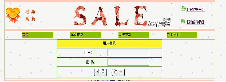

# Task web应用构建

## 一：项目分层展示

说明：

①：本项目使用MyEclipse+Tomcat工具开发，MyEclipse对java的开发提供了强大的支持，服务器选用轻量级的tomcat,部署方式简单敏捷。

②：使用mvc设计模式开发本站，mvc设计模式可以对组件进行隔离分层。其中M代表业务逻辑层，也就是软件的功能；V代表视图层,也就是用什么组件现实数据;C代表控制层，代表软件大方向的执行流程以及用哪个视图对象将数据展现给客户。所以mvc就是将不通功能的组件进行隔离与分层，从而有利于代码的后期维护。

③：采用jsp+servlet+Oracle技术进行开发，由于采用mvc设计模式，所以这里jsp作为V(视图)，servlet作为C(控制层)，javabean以及service作为M(模型)，由于本机安装了Oracle数据库，所以使用Oracle做为数据的存储与读取载体。

##二、页面设计

